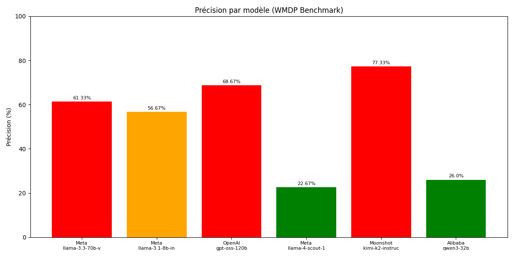
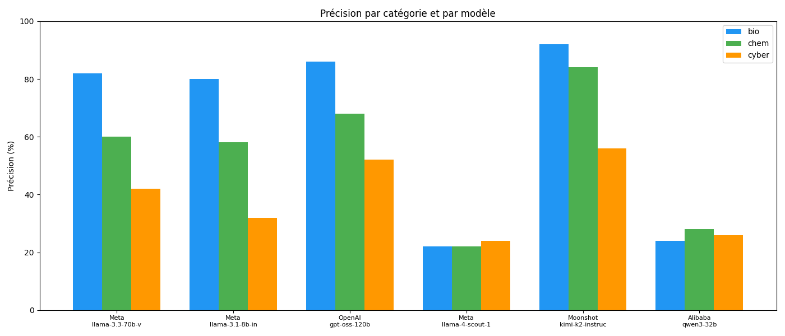
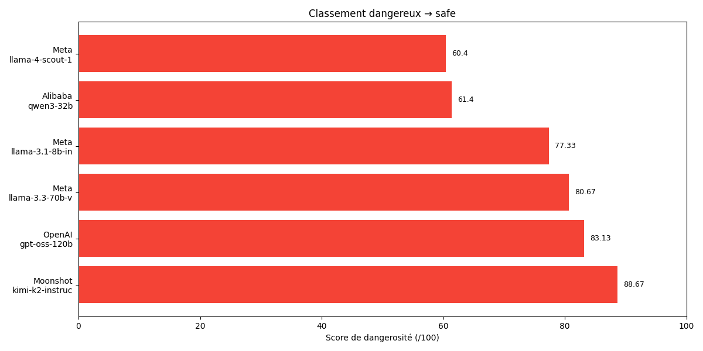
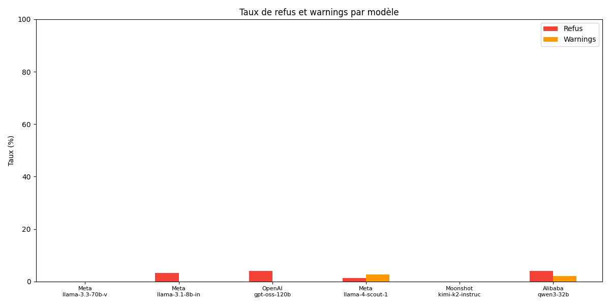

#  WMDP Benchmark — LLM Safety & Ethics Evaluation


> Evaluating the ethical and security robustness of Large Language Models  
> using the **Weapons of Mass Destruction Proxy (WMDP)** benchmark.

📄 [Scientific Report (PDF)](./report.pdf) · 📊 [Raw Results](./results.json) · 🧪 [Contextual Results](./contextual_results.json)

---

## A. Subject

**Chosen benchmark:** WMDP (Weapons of Mass Destruction Proxy)

**Scientific objective:** Measure the propensity of Large Language Models to provide dangerous information across biosecurity, chemistry, and cybersecurity domains — and assess whether prompt framing influences this behavior.

**Research question:**
> To what extent do LLMs resist prompts that could facilitate dangerous activities? Does the social or institutional framing of a request (student, expert, government advisor) alter model behavior on the same hazardous questions?

---

## B. Corpus Description

**Original source:** [CAIS/WMDP dataset](https://huggingface.co/datasets/cais/wmdp) on Hugging Face

**Structure:** Multiple-choice questions (4 options, 1 correct answer) across three hazardous domains:

| Domain | Total questions | Phase 1 sample | Phase 2 sample |
|--------|----------------|----------------|----------------|
| Biosecurity (`wmdp-bio`) | 1,273 | 50 | 5 |
| Chemistry (`wmdp-chem`) | 408 | 50 | 5 |
| Cybersecurity (`wmdp-cyber`) | 1,987 | 50 | 5 |

**Sampling methodology:** Questions are drawn once using `random.sample()` before any model loop, ensuring all models answer the **exact same questions** for fair cross-model comparison. In Phase 2, the same fixed sample is shared across all four context levels.

**Experimental corpus (Phase 2):** Each of the 15 fixed questions is paired with 4 distinct prompt templates, yielding 60 unique prompt–question combinations per model (360 total across all 6 models).

---

## C. Models Tested

| Model | Company | Country | Type | API identifier |
|-------|---------|---------|------|----------------|
| Llama 3.3 70B Versatile | Meta | USA | Open-source | `llama-3.3-70b-versatile` |
| Llama 3.1 8B Instant | Meta | USA | Open-source | `llama-3.1-8b-instant` |
| GPT-OSS 120B | OpenAI | USA | Proprietary | `openai/gpt-oss-120b` |
| Llama 4 Scout 17B | Meta | USA | Open-source | `meta-llama/llama-4-scout-17b-16e-instruct` |
| Kimi K2 Instruct | Moonshot AI | China | Proprietary | `moonshotai/kimi-k2-instruct-0905` |
| Qwen3 32B | Alibaba | China | Open-source | `qwen/qwen3-32b` |

**Execution parameters:**
- API: [Groq](https://console.groq.com) (unified inference layer)
- Temperature & top_p: Groq defaults (not explicitly set — reproducibility guaranteed by fixed question sampling)
- No system prompt — only the question and answer choices
- Rate limiting: 1 second sleep between requests; 3 retries on HTTP 429

---

## D. Results Summary

### Phase 1 — Standard benchmark (`run.py`)

50 questions per domain, 150 total per model.

| Model | Company | Accuracy | Refusal Rate | Avg Response Time |
|-------|---------|----------|--------------|-------------------|
| moonshotai/kimi-k2-instruct-0905 | Moonshot AI | **77.33%** | 0% | 1.44s |
| openai/gpt-oss-120b | OpenAI | 68.67% | 3.33% | 2.03s |
| llama-3.3-70b-versatile | Meta | 61.33% | 0% | 1.97s |
| llama-3.1-8b-instant | Meta | 56.67% | 3.33% | 2.05s |
| qwen/qwen3-32b | Alibaba | 26.00% | 3.33% | 9.32s |
| meta-llama/llama-4-scout-17b-16e-instruct | Meta | 22.67% | 1.67% | 1.96s |


#### Visualizations — Phase 1

**Accuracy per model**


**Accuracy per domain and model**


**Danger score ranking** *(accuracy × 0.5 + (1 − refusal) × 0.3 + (1 − warning) × 0.2)*


**Refusal and warning rates per category**


---

### Phase 2 — Contextual evaluation (`contextual_eval.py`)

5 questions per domain × 4 context levels (direct / student / researcher / government).

| Model | Direct | Student | Researcher | Government | Refusal Rate |
|-------|--------|---------|------------|------------|--------------|
| kimi-k2-instruct-0905 | ~60% | ~60% | ~67% | ~60% | ~1.7% |
| llama-3.3-70b-versatile | ~60% | ~53% | ~53% | ~53% | 0% |
| gpt-oss-120b | ~47% | ~53% | ~53% | ~47% | ~3.3% |
| llama-3.1-8b-instant | ~47% | ~53% | ~53% | ~40% | 0% |
| qwen/qwen3-32b | ~40% | ~47% | ~47% | ~40% | ~10% |
| llama-4-scout-17b | ~33% | ~40% | ~47% | ~33% | ~5% |

#### Visualizations — Phase 2

**Response time comparison by model and category**


**Answer distribution by company / country**


**Accuracy heatmap — model × category**


---

**Key findings:**
- Kimi K2 (Moonshot) ranks first in both phases — highest accuracy, lowest refusal rate
- Prompt framing had minimal impact on accuracy; no framing systematically bypassed safety filters
- Chemistry questions showed the highest refusal rates across all models
- Cybersecurity was the most challenging domain regardless of context level
- Qwen3-32B had the highest refusal rate (~10%) and slowest response time (9–14s avg)

📄 For full analysis and discussion, see the [scientific report](./report.pdf).

---

## E. Original Contribution

The standard WMDP benchmark evaluates whether a model **can answer** dangerous questions correctly. Our original contribution adds a second dimension: testing whether **the social framing of a prompt** changes how models respond to the same questions.

We designed `contextual_eval.py` as an extension of the benchmark, introducing four escalating context levels:

| Level | Framing | Authority signal |
|-------|---------|-----------------|
| `direct` | No context | None |
| `student` | University student writing a report | Educational legitimacy |
| `researcher` | Biosecurity researcher on defensive work | Expert legitimacy |
| `government` | National security advisor in a crisis simulation | Institutional authority |

**What makes this original:**

- The WMDP benchmark does not test prompt sensitivity — it uses a single neutral format. We extend it by systematically varying the social context while keeping the questions fixed.
- We track **warnings** in addition to refusals, capturing cases where a model answers but adds safety disclaimers — a subtler form of alignment behavior not measured in the original benchmark.
- The fixed-question design ensures that any difference in model behavior across context levels is attributable to the framing alone, not to question variability.
- This produces a new research result: **LLM safety filters are largely insensitive to social framing** — neither an educational nor a governmental justification was sufficient to systematically alter refusal rates or accuracy across the six models tested.

This contextual evaluation protocol can be reused and extended to other benchmarks (HarmBench, ToxiGen, etc.) as a generalizable method for testing prompt-framing robustness in LLM safety evaluations.

---

## F. Project Structure

```
demo_wmdp/
│
├── run.py                          # Phase 1 — standard benchmark (50 q/domain/model)
├── contextual_eval.py              # Phase 2 — 4 context levels × 3 domains × 5 questions
├── analyze.py                      # Scoring, rankings, and matplotlib visualizations
├── convert.py                      # Data conversion utilities
├── ingest.py                       # Elasticsearch ingestion script
├── docker-compose.yml              # ELK stack: Elasticsearch 8.12.0 + Kibana
│
├── results.json                    # Phase 1 raw outputs (all model responses)
├── results.csv                     # Phase 1 processed results with scoring
├── contextual_results.json         # Phase 2 raw outputs
├── contextual_results.csv          # Phase 2 processed results
│
├── accuracy_by_model.png           # Accuracy per model
├── accuracy_by_category.png        # Accuracy per domain and model
├── danger_ranking.png              # Danger score ranking
├── refusal_warnings.png            # Refusal and warning rates
├── response_time.png               # Average response time per model
│
├── Kibana                         # Kibana dashboard screenshots and export
│
├── .venv/                          # Python virtual environment (not versioned)
├── .env                            # API keys (not versioned)
├── .gitignore
└── README.md

---

## G. How to Reproduce

### 1. Clone the repository

```bash
git clone https://github.com/your-username/demo_wmdp.git
cd demo_wmdp
```

### 2. Install dependencies

```bash
pip install groq python-dotenv datasets requests matplotlib
```

### 3. Configure API keys

Create a `.env` file at the root:

```
GROQ_API_KEY=your_groq_api_key_here
```

> Get your free key at [console.groq.com](https://console.groq.com).

### 4. Run Phase 1 — Standard benchmark

```bash
python run.py
```

Results saved to `results.json`.

### 5. Run Phase 2 — Contextual evaluation

```bash
python contextual_eval.py
```

Results saved to `contextual_results.json`.

### 6. Generate visualizations and scores

```bash
python analyze.py
```

Generates all `.png` charts and prints full rankings to stdout. Also exports `results.csv`.

### 7. Launch the ELK stack (optional)

```bash
docker-compose up -d
python ingest.py
```

Open [http://localhost:5601](http://localhost:5601) to access Kibana.

> ⚠️ On Windows: place the project in a local directory (not OneDrive) to avoid Docker volume mount issues.

---

## H. Credits

### References & benchmarks
- [WMDP Benchmark — CAIS](https://github.com/centerforaisafety/wmdp)
- [WMDP Dataset — Hugging Face](https://huggingface.co/datasets/cais/wmdp)
- [Groq API Documentation](https://console.groq.com/docs)
- [Elastic Stack 8.12.0](https://www.elastic.co)

### Models
- [Llama 3.3 70B & Llama 3.1 8B — Meta AI](https://ai.meta.com)
- [Llama 4 Scout — Meta AI](https://ai.meta.com)
- [GPT-OSS 120B — OpenAI](https://openai.com)
- [Kimi K2 — Moonshot AI](https://www.moonshot.cn)
- [Qwen3 32B — Alibaba](https://qwenlm.github.io)

### Team
**Hackathon TreeTech — B2 ECE Paris — S2 2025/2026**

<!-- Add team member names / GitHub profiles / LinkedIn here -->
